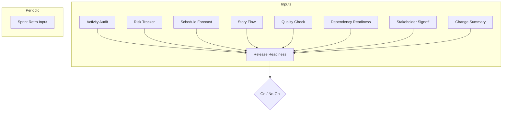

# Project Intelligence Module (PIM)

The **Project Intelligence Module (PIM)** adds an "Observer" agent to your BMAD project. This agent provides data-driven insights, risk detection, and readiness assessments without emotional bias.

## Installation

Prerequisites:
- [BMAD CLI](https://github.com/bmad-code-org/bmad-method) installed (`npm install -g bmad-method` or equivalent).
- The `pim` folder from this repository.

To install PIM into your project:

1.  **Get the Module**: Ensure you have the `pim` folder on your machine.
2.  **Run Installer**: From your project root, run the BMAD installer pointing to the `pim` directory:
    ```bash
    bmad install --custom-content ./path/to/pim
    ```
3.  **Select Module**: In the installer menu, ensure "Project Intelligence Module" IS selected (it usually appears at the bottom).
4.  **Confirm**: Complete the installation wizard.

## Usage

Call PIM skills using the Observer agent or via direct slash commands (if configured):

```bash
/pim/risk-tracker
/pim/schedule-forecast
/pim/release-readiness
```

## Skills Overview

### 1. Core Signals (The Inputs)
These skills gather raw data from specific domains.

| Skill | Description | Key Input |
|-------|-------------|-----------|
| **[Risk Tracker](workflows/risk-tracker)** | Detects and escalates risks/issues. | `sprint-status.yaml` |
| **[Activity Audit](workflows/activity-audit)** | Verifies reported status vs actual git activity. | `git log`, status |
| **[Schedule Forecast](workflows/schedule-forecast)** | Forecasts dates using velocity (near-term) & sizing (long-term). | `sprint-status`, `epics.md` |
| **[Story Flow](workflows/story-flow)** | Diagnoses cycle time stalls and blockers. | `sprint-status` |
| **[Quality Check](workflows/quality-check)** | Summarizes tests, reviews, and audit signals. | Test results |
| **[Dependency Readiness](workflows/dependency-readiness)** | Checks external vendors, partners, and infra. | `epics.md` |
| **[Stakeholder Signoff](workflows/stakeholder-signoff)** | Tracks enablement and explicit approvals. | `epics.md` |
| **[Sprint Retro Input](workflows/sprint-retro-input)** | Generates neutral observations for retros. | `sprint-status` |
| **[Change Summary](workflows/change-summary)** | Summarizes what changed (Iteration or Delta). | `epics.md`, status |

### 2. Aggregators (The Decision Makers)
These skills synthesize inputs to help you make decisions.

| Skill | Description | Aggregates |
|-------|-------------|------------|
| **[Release Readiness](workflows/release-readiness)** | Go/No-Go decision for milestones. | **ALL** of the above |

## Skill Relationships



## Configuration

PIM relies on standard BMAD artifacts defined in your `bmm/config.yaml`, specifically:
- `implementation_artifacts` (for `sprint-status.yaml`)
- `planning_artifacts` (for `epics.md`)

Ensure these are populated to get the best results.
